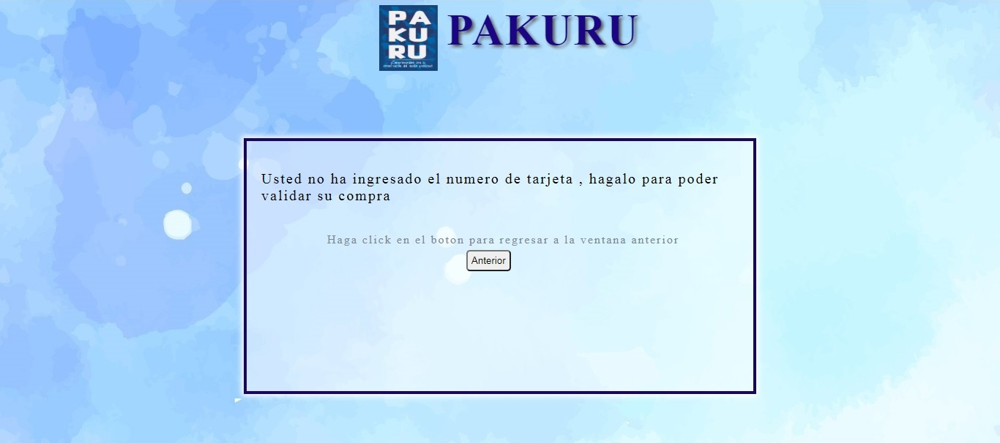
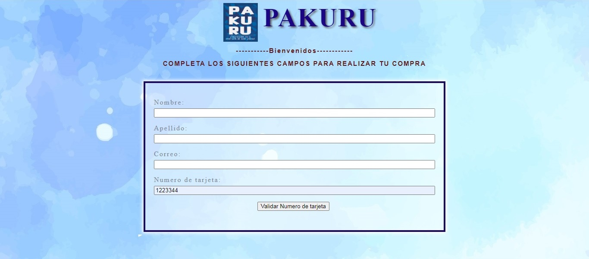

#PAKURU - CONSERVEMOS POR AMOR
## 1. Descripción

Es una web que te permitira ayudar a la conservacion de animales en peligro de extinción, enfocandonos en 10 animales que necesitan proyectección:
Son los siguientes: 

- Mono choro de cola amarilla
- Pinguino de Humboolt
- Chinchilla
- Manati
- Caiman negro
- Pava aliblanca
- Gato andino
- Rana del titicana
- Condor andino 
- Oso andino.

## 2. Investigación Ux

### 1. Quienes son los principales usuarios del producto

Los usuarios son todos los interesados en la proteccion de animales en peligro de extinción, nos enfocaremos principalmente es estudiantes de la carreras ingenieria ambiental, forestal, biologia, entre otras. Que tenga en su malla curricular temas de protección de animales, a su vez con organziciones públicas y privadas que tenga la visión de protección como ONG, SERFOR, etc. 

### 2. Cuáles son los objetivos de estos usuarios en relación con tu producto.
Mediantes la venta de polos con mensajes de proteccion e imagenes de los animales, empezaremos con la concientización y dar a conocer el peligro en que se encuentres estos animales. Y la necesidad de protegerlos.

#### 3. Cómo crees que el producto que estás creando está resolviendo sus problemas.

 No todas las personas saben sobre que animales estan en peligro de extinción, el dar a conocerlos y sepan cuales son, nos podra dar un punto de partida y a su vez conseguir aliados para su protección. 
. 

## 3. Maquetado.

### Primera ventana

### Segunda ventana si el Numero de tarjeta es invalido

### Segunda ventana si el Numero de tarjeta es valido

### Estructura de los archivos a usar

### Primera ventana sin funcionalidad

### Segunda ventana sin funcionalidad

## 4. Feedback
Al mostrar el prototipo a amigos y miembros del squad recibí el sigueinte feedback:

 * Me sugirienron cambiar los colores por que hacian mucho contraste. 
 * Hacer el contenedor mas grande para que se visualize la informacion mejor.
 * Me sugirieron mostrar el resultado en otro hmtl y no como alerta.
 * Recomendaron nombrar mejor a mis variables para que no genere confusion al ser revisado por otra persona.
 
## 5. Imagen del prototipo final
### 5.1 Caso de no ingresar el numero de tarjeta y apretar el boton.

### 5.2 Caso de ingresar el numero de tarjeta pero no todos los caracteres son numericos.

### 5.3 Caso si el Numero de tarjeta es valido pero no cumple el algoritmo de Lumm.

### 5.4 Caso si el Numero de tarjeta es valido y cumple el algoritmo de Lumm.

## 6. Git-Github y ejecucion

### 6.1 Git-Github

* Usamos el comando "git init" para crear una carpeta oculta llamada .git en el working directory, en la raíz del proyecto.

* Usamamos el comando "git add. " para poder agregar todos los archivos a mi git.

* Usamos el " git commit -m '' " para poder comentar lo que se va a agregar.

* Cobn el comando " git push " se sube al github nuestro codigo.

### 6.2 HTML,CSS y JS

#### 6.2.1 HTML
Nuestro archivo HTML es index.hmtl , en este usaremos dos bloques principales el ( header y div ) los cuales tendran la funcionalidad de alternar su display.

#### 6.2.2 CSS
El nombre del archivo CSS es style.css , en este encontraremos la imagen de fondo , y los estilos necesarios para el html.

#### 6.2.3 JS
Los nombres para los archivos JS son ( index.js , validator.js y validator.spec.js ).
* index.js : En este programa daremos funcionalidad a nuestro html , mediante la accion interactiva de intercambiar la visibilidad de las secciones del hmtl , ademas de que cambiaremos el contenido en cada seccion . Aparte de que integraremos la accion de retorno mediante un boton.

* validator.js : En este script se construye un objeto con dos metodos ( maskify y isValid ) estos reciben de entrada un input del html, este se enlaza primero con el index.js.

* validator.spec.js : Este script nos permite hacer las pruebas unitarias de validator.js.

